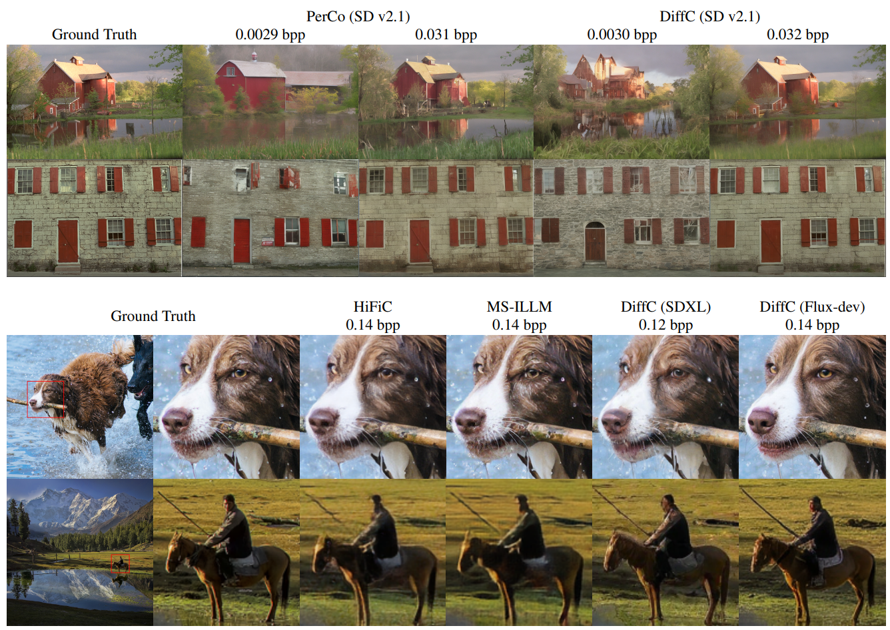
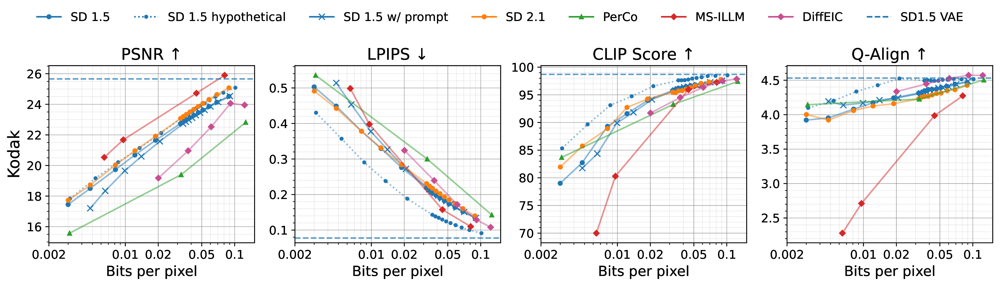
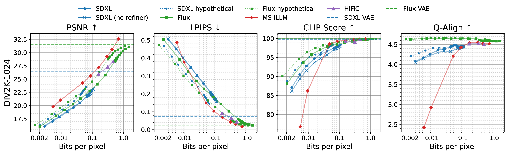

# Lossy Compression with Pretrained Diffusion Models

Official implementation of Lossy Compression with Pretrained Diffusion Models by Jeremy Vonderfect and Feng Liu. ArXiv and project page links coming soon.

## Abstract

We apply the DiffC algorithm[^1] to [Stable Diffusion](https://huggingface.co/stabilityai/stable-diffusion-2-1) 1.5, 2.1, XL, and [Flux-dev](https://huggingface.co/black-forest-labs/FLUX.1-dev), and demonstrate that these pretrained models are remarkably capable lossy image compressors. A principled algorithm for lossy compression using pretrained diffusion models has been understood since at least Ho et al.[^2], but challenges in reverse-channel coding have prevented such algorithms from ever being fully implemented. We introduce simple workarounds that lead to the first complete implementation of DiffC, which is capable of compressing and decompressing images using Stable Diffusion in under 10 seconds. Despite requiring no additional training, our method is competitive with other state-of-the-art generative compression methods at low ultra-low bitrates.

## Results



In the following rate-distortion curves, SD1.5, SD2.1, SDXL, and Flux represent the DiffC algorithm with those respective diffusion models. The dashed horizontal 'VAE' lines represent the best achievable metrics given the fidelity of the model's variational autoencoder.




## Setup

```
git clone https://github.com/JeremyIV/diffc.git
cd diffusion-compression
conda env create -f environment.yml
conda activate diffusion-compression
```

## Usage

```
python evaluate.py --config configs/SD-1.5-base.yaml --image_dir data/kodak --output_dir results/SD-1.5-base/kodak
```

To save the compressed representation of an image as a `diffc` file, use

```
python compress.py --config configs/SD-1.5-base.yaml --image_dir data/kodak --output_dir results/SD-1.5-base/kodak/compressed
```

To reconstruct an image/images from their compressed representations, use

```
python decompress.py --config configs/SD-1.5-base.yaml --input_dir results/SD-1.5-base/kodak/compressed --output_dir results/SD-1.5-base/kodak/reconstructions
```

## Citation

```bibtex
@misc{Vonderfecht2024lossy,
  author = "{Jeremy Vonderfecht, Feng Liu}",
  title = "Lossy Compression With Pretrained Diffusion Models",
  year = "2024",
}
```

## Acknowledgements

Thanks to https://github.com/danieleades/arithmetic-coding for the entropy coding library.

[^1]: Theis, L., Salimans, T., Hoffman, M. D., & Mentzer, F. (2022). [Lossy compression with gaussian diffusion](https://arxiv.org/abs/2206.08889). arXiv preprint arXiv:2206.08889.
[^2]: Ho, J., Jain, A., & Abbeel, P. (2020). [Denoising diffusion probabilistic models](https://arxiv.org/abs/2006.11239). Advances in Neural Information Processing Systems, 33, 6840-6851.